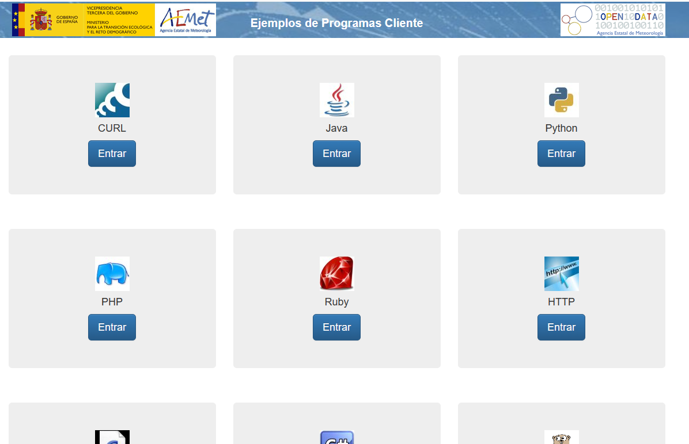
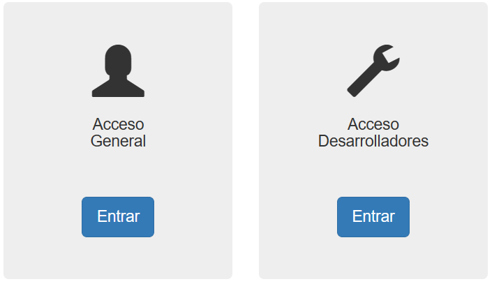
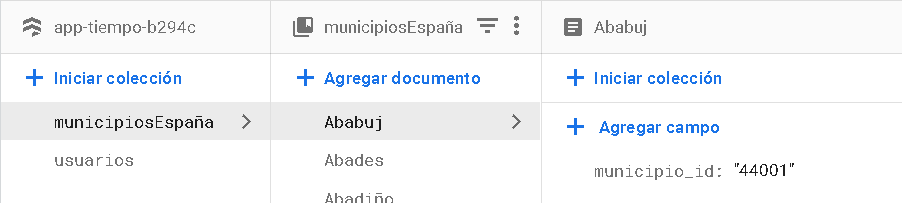

<body class="c25 c35 doc-content">
    

    <h1 class="c19 c9" id="h.6avoa2b8iahn">Introducci&oacute;n de la aplicaci&oacute;n.</h1>
    
Nuestra aplicaci&oacute;n se encarga de darnos datos relevantes del tiempo de los
            municipios de Espa&ntilde;a. 

    

    
Recogemos los datos de la Agencia Estatal de Meteorolog&iacute;a a trav&eacute;s de
            su propia API.

    
El funcionamiento de cara al usuario es el siguiente: el usuario realiza una
            petici&oacute;n de tiempo poniendo el nombre de un municipio. A continuaci&oacute;n, pulsaremos el
            bot&oacute;n &lsquo;CONSULTAR&rsquo; para realizar la petici&oacute;n a la API y rescatar los datos
            necesarios.

    

    
El proyecto comenz&oacute; siendo una inspiraci&oacute;n de la aplicaci&oacute;n del
            tiempo propia de la AEMET. 

    

    
Respecto a otras aplicaciones del tiempo, nuestra aplicaci&oacute;n implementa la API
            de AEMET.

    
Eso nos da m&aacute;s precisi&oacute;n a la hora de consultar el tiempo a nivel del
            territorio espa&ntilde;ol, ya que la misma agencia tiene sus propias estaciones
            meteorol&oacute;gicas.

    

    
El desarrollo de la aplicaci&oacute;n ha sido desde cero, ya que no hemos cogido
            c&oacute;digo existente.

    
Si es cierto que nos hemos documentado ampliamente en varias fuentes para llegar al
            resultado actual, ya sea para hacer request a la API, recoger los datos de ella o implementar
            Firebase.

    

    
A la hora de elegir la API, encontramos opciones como <a class="c0"
                href="https://www.google.com/url?q=https://rapidapi.com/&amp;sa=D&amp;source=editors&amp;ust=1677965118887561&amp;usg=AOvVaw1Xz8hBx0xapkgQWNZM0ARx">Rapidapi.com</a>&nbsp;(distribuidora
            de APIs)&nbsp; o <a class="c0"
                href="https://www.google.com/url?q=https://www.el-tiempo.net/api&amp;sa=D&amp;source=editors&amp;ust=1677965118887925&amp;usg=AOvVaw07MWso_bt71cnbriFgUwqr">elTiempo.net</a>, pero nos decidimos al final por la API de AEMET. 

    
Al ser la propia API de una instituci&oacute;n p&uacute;blica nos transmit&iacute;a m&aacute;s
            confianza a la hora de obtener los datos, ya que son de sus propias estaciones meteorol&oacute;gicas.
    

    

    

    <h1 class="c19 c9" id="h.krlsuk4tzblr">Flujo de ejecuci&oacute;n de la aplicaci&oacute;n
    </h1>
    <h2 class="c20 c9" id="h.qax35hobgsal">Login</h2>
    
Nuestra aplicaci&oacute;n comienza con un login en el que el usuario debe ingresar su
            email y contrase&ntilde;a. Una vez ingresados dichos campos se le debe dar al bot&oacute;n
            &lsquo;ACCEDER&rsquo; para tener acceso completo a la aplicaci&oacute;n. Tenemos un bot&oacute;n especial
            que sirve para que tu sesi&oacute;n no se cierre una vez cerrada la aplicaci&oacute;n que es el bot&oacute;n
            de &lsquo;Recuerdame&rsquo;. Tambi&eacute;n tenemos dos apartados m&aacute;s. Uno para crearse una cuenta
            con la que poder acceder y otro para poder recuperar la contrase&ntilde;a.

    

    

    

    <h2 class="c3 c9" id="h.asnufjgnpxdr">Registro</h2>
    

    

    
Pasemos al crear cuenta. Consta de varios campos necesarios para poder loguearse:
            Nombre, Email, Contrase&ntilde;a y la confirmaci&oacute;n de la contrase&ntilde;a. Tiene dos botones para
            Volver al Login y otro para confirmar el registro, realiza varias validaciones en los campos para que no
            haya errores.

    

    
Al crear una cuenta, la aplicaci&oacute;n manda un correo al usuario que se ha
            registrado. Esto sirve para controlar el acceso para las cuentas verificadas.

    

    <h2 class="c3 c9 c28" id="h.w5in0twoosx"></h2>
    <h2 class="c3 c9" id="h.p8tjdwfcqff">Recuperar contrase&ntilde;a</h2>
    

    
A continuaci&oacute;n, pasaremos a la recuperaci&oacute;n de la
            contrase&ntilde;a.

    

    
Esta actividad funciona de la siguiente manera: el usuario rellena el apartado de
            email y le da al bot&oacute;n de &lsquo;Recuperar&rsquo;, se le enviar&aacute; a su gmail un mensaje de
            reseteo de contrase&ntilde;a, a continuaci&oacute;n el usuario se debe de dirigir al correo y abrir el
            enlace. Se le aparecer&aacute; una ventana para cambiar la contrase&ntilde;a, ah&iacute; deber&aacute;
            insertar la nueva contrase&ntilde;a.

    

    

    <h2 class="c20 c9" id="h.yq84u3m144jo">Main activity, consulta de datos y cerrado de
            sesi&oacute;n</h2>
    

    
Una vez el usuario se ha logueado, le aparecer&aacute; una nueva actividad que le
            dejar&aacute; hacer dos opciones, una Cerrar sesi&oacute;n y otra cambiar a la actividad de consultar
            tiempo.

    

    

    

    
Finalmente llegamos a la actividad para consultar el tiempo. En esta actividad hay un
            EditText en el que debemos de escribir el nombre del municipio. A continuaci&oacute;n pulsamos el
            bot&oacute;n de &lsquo;CONSULTAR&rsquo; y nos mostrar&iacute;a algo similar al ejemplo de abajo.

    

    <h2 class="c20 c9" id="h.73zkn1b12qd1">Men&uacute; de navegaci&oacute;n y
            Configuraci&oacute;n</h2>
    

    
Aqu&iacute; mostramos como se puede navegar entre pantallas una vez se inicia
            sesi&oacute;n.

    

    

    
Dentro del apartado de configuraci&oacute;n, hemos a&ntilde;adido la opci&oacute;n de
            cambiar la contrase&ntilde;a de la cuenta, de eliminar la cuenta y de cambiar el idioma de la
            aplicaci&oacute;n.

    

    

    <h1 class="c19 c9" id="h.ewztw7u1a7at">Elementos introducidos en la aplicaci&oacute;n</h1>
    <h2 class="c20 c9 c28" id="h.urgtjpxc8dbz"></h2>
    <h2 class="c20 c9" id="h.aqsgnbmm8255">&iquest;Qu&eacute; es una API?</h2>
    

    
Una API (del ingl&eacute;s: Application Programming Interface), es el conjunto de
            subrutinas, funciones y procedimientos que ofrece cierto ente (en este caso, AEMET) para ser utilizado por
            un software de un tercero para la obtenci&oacute;n de datos, informaci&oacute;n, documentos, etc.

    

    
En este caso, hemos implementado en Java el protocolo API REST, el cual es una un API
            apoyada totalmente en el est&aacute;ndar HTTP. Visto de una forma m&aacute;s sencilla, una API REST es un
            servicio que nos provee de funciones que nos dan la capacidad de hacer uso de un servicio web que no es
            nuestro, dentro de una aplicaci&oacute;n propia, de manera segura.

    

    <h2 class="c20 c9" id="h.w42e6auatmk">Tipos de acceso</h2>
    

    
En la <a class="c0"
                href="https://www.google.com/url?q=https://opendata.aemet.es/centrodedescargas/inicio&amp;sa=D&amp;source=editors&amp;ust=1677965118892906&amp;usg=AOvVaw3alEfd9cTK6KmZJpJxyUQS">AEMET
                OpenData</a>&nbsp;hay dos tipos de acceso a usuarios: el acceso general y el
            acceso para desarrolladores.

    

    
El acceso para el p&uacute;blico en general tiene como finalidad el permitir el
            acceso a los datos para usuarios de una manera amigable. Por otro lado, el acceso para desarrolladores se
            caracteriza por la posibilidad de ser peri&oacute;dica e incluso programada, realizada a trav&eacute;s de un
            API destinada a un sistema inform&aacute;tico, que permite a los usuarios el incluir los datos de AEMET en
            sus propios sistemas de informaci&oacute;n.

    

    

    

    

    <h2 class="c20 c9 c28" id="h.2bue5yhc1z6p"></h2>
    <h2 class="c20 c9" id="h.f9839xvi3hhp">Obtenci&oacute;n de la API: AEMET OpenData.</h2>
    
Para la obtenci&oacute;n de la API nos hemos metido en la p&aacute;gina de <a class="c0"
                href="https://www.google.com/url?q=https://opendata.aemet.es/centrodedescargas/inicio&amp;sa=D&amp;source=editors&amp;ust=1677965118893928&amp;usg=AOvVaw1FcAgWeDItCu6YSNk1GZfp">AEMET
                OpenData</a>. Dicha API permite la difusi&oacute;n y la reutilizaci&oacute;n de
            la informaci&oacute;n meteorol&oacute;gica y climatol&oacute;gica de la Agencia Estatal de
            Meteorolog&iacute;a (AEMET).

    

    

    
Primero, hemos solicitado nuestra API Key, la cual es completamente gratuita.
    

    
Las API Keys son identificadores &uacute;nicos otorgados a cada solicitante,&nbsp;mediante los cuales se contabilizan e imputan los accesos que
            un usuario realiza al API.

    

    
La API Key se puede solicitar desde la opci&oacute;n &quot;Obtenci&oacute;n de API
            Key&quot; de la p&aacute;gina principal de AEMET OpenData introduciendo su direcci&oacute;n de correo
            electr&oacute;nico.

    
Una vez introducido el email, nos llega un correo con el enlace de activaci&oacute;n
            y posteriormente, te env&iacute;an otro con la API Key.

    

    

    

    

    

    

    <h2 class="c20 c9 c28" id="h.5bcvwv7wwhag"></h2>
    <h2 class="c20 c9" id="h.vdlguz2pgu0g">Acceso para desarrolladores</h2>
    

    
En nuestro caso, nosotros hemos utilizado el acceso a desarrolladores, el cual ofrece
            tres apartados para la implementaci&oacute;n de la API.

    

    

    

    
En el primer caso tenemos la parte de documentaci&oacute;n, la cual nos da acceso a
            la documentaci&oacute;n din&aacute;mica de AEMET OpenData y a la herramienta de HATEOAS, que permite conocer
            los recursos del API y sus detalles. <a class="c0"
                href="https://www.google.com/url?q=https://opendata.aemet.es/dist/index.html?%23/&amp;sa=D&amp;source=editors&amp;ust=1677965118896170&amp;usg=AOvVaw1qksl5c-G7-MJXCUESqdHS">Swagger
                UI (aemet.es)</a>

    

    
Para la obtenci&oacute;n del enlace de petici&oacute;n, nos hemos centrado en el
            apartado de predicciones espec&iacute;ficas.

    
Para nuestra aplicaci&oacute;n, hemos utilizado el enlace de la predicci&oacute;n del
            municipio diaria.

    
Previo a ello, se debe conocer el c&oacute;digo INE (Instituto Nacional de
            Estad&iacute;stica) para poder hacer la consulta.

    

    

    

    

    
En la propia p&aacute;gina se puede hacer una prueba de la consulta.

    

    

    

    
En segundo lugar, tenemos los ejemplos de como hacer la consulta a la API en
            distintos lenguajes de programaci&oacute;n. En nuestro caso, elegimos Java.

    

    

    

    
Dentro del ejemplo del cliente de Java, tenemos la opci&oacute;n de hacer la consulta
            con la librer&iacute;a de OKHTTP o por la de UNIREST. Nosotros hemos elegido la primera
            opci&oacute;n.

    
Cabe destacar que las consultas de las API Rest devuelven la informaci&oacute;n en
            forma de JSON.

    

    <h2 class="c3 c9" id="h.kk1xikj65yqw">&iquest;Qu&eacute; es OKHTTP3?</h2>
    
OKHTTP3 es una librer&iacute;a de c&oacute;digo abierto la cual permite realizar
            operaciones tanto en HTTP como en SPDY de manera sencilla y eficiente en ambientes Java (versi&oacute;n 1.7
            como m&iacute;nimo) y Android (2.3 como m&iacute;nimo), sin necesidad de cambiar el c&oacute;digo de la
            aplicaci&oacute;n entre ambas plataformas, con una interfaz fluida.

    

    <h2 class="c3 c9" id="h.cvnz524q6su4">&iquest;Qu&eacute; es JSON?</h2>
    
JSON es un lenguaje de marcas sencillo para el intercambio de datos. Se trata de un
            subconjunto de la notaci&oacute;n literal de objetos de JavaScript, aunque, debido a su amplia
            adopci&oacute;n como alternativa a XML, se considera un formato independiente del lenguaje.

    

    <h2 class="c3 c9" id="h.zafspjmo3goe">Herramientas utilizadas para JSON</h2>
    
Hemos utilizado el editor de c&oacute;digo VSCode para leer el JSON; una
            extensi&oacute;n para ayudarnos a visualizar el c&oacute;digo mejor llamado Sort JSON Objects y Postman, una
            plataforma para realizar pruebas con API Rest.

    

    

    

    

    
&nbsp;

    

    <h2 class="c3 c9" id="h.34s8rezcowff">Implementaci&oacute;n de la API</h2>
    
Una vez obtenida toda la informaci&oacute;n de la API, procedemos a implementar la
            API en Android Studio.

    
En primer lugar, hemos utilizado las siguientes dependencias: OKHTTP3 (para la
            consulta de la API) y GSON (para manejar la consulta en formato JSON).

    

    <h2 class="c17 c9" id="h.kos0609a8gji"></h2>
    

    
As&iacute; es como se implementar&iacute;a OKHTTP3 a la hora de hacer la Request. En
            primer lugar creamos un cliente, luego preparamos la &ldquo;Request&rdquo; y con el m&eacute;todo Builder
            creamos el cuerpo de la petici&oacute;n. 

    
A la hora de hacer una petici&oacute;n a la API, se utiliza el m&eacute;todo GET para
            obtener los datos.

    
En nuestro caso no har&iacute;a falta ponerle ning&uacute;n &ldquo;Body&rdquo;, ya
            que la propia API devuelve la consulta en forma de JSON.

    

    

    
Finalmente, metemos la solicitud en cola y a trav&eacute;s de la interfaz del cliente
            OKHTTP recogemos la respuesta.

    

    
Como hemos mencionado anteriormente, la respuesta nos la da en JSON, por lo cual el
            String que nos da lo tenemos que meter en un JSON Array o un JSON Object en funci&oacute;n de c&oacute;mo
            devuelva la respuesta.

    

    <h2 class="c3 c9" id="h.4pbpnk36tr8d">M&eacute;todos empleados</h2>
    
public void getIDMunicipio(String
            municipio_nombre, final IDMunicipioCallback
            callback)

    
Este m&eacute;todo se encuentra en la clase ConsultarTiempo.java y se encarga de
            buscar el id del municipio correspondiente a lo que se ha escrito en el EditText. Lo que hace es leer un
            JSON subido en Firebase en el que est&aacute;n todos los municipios de Espa&ntilde;a con sus respectivos
            IDs. Los par&aacute;metros que le entran son: el nombre del municipio que queremos buscar y una interfaz
            para buscar el municipio. La interfaz que implementamos nos resuelve un problema de sincronizaci&oacute;n
            entre el programa y el propio Firebase, act&uacute;a como una especie de &lsquo;hilo&rsquo; sin serlo. Esta
            funci&oacute;n ser&aacute; llamada dentro de hacerConsulta().

    

    
public static String getURL(JSONObject jsonobj)

    
Este m&eacute;todo se encarga de extraer la URL de la primera request que se le
            hace a la API. Le entra por par&aacute;metro un JSONObject, y lo que hace es obtener de esa gama de datos,
            el que tiene la URL que nos servir&aacute; para hacer la segunda request. Retorna un String con la URL
            obtenida.

    

    
public void hacerConsulta(View
            view) throws IOException

    
En este m&eacute;todo como tal no se hace la consulta directamente. Primero llama
            a la funci&oacute;n getIDMunicipio al que le pasa por par&aacute;metro el EditText con la petici&oacute;n
            del usuario y la interfaz. Una vez ejecutada esta funci&oacute;n para obtener el ID, comprueba si lo que
            retorna est&aacute; vac&iacute;o o nulo para dar un feedback al usuario de que no ha encontrado datos, si no
            llama a la funci&oacute;n getEnlaceHttpok que es la que realizar&aacute; la request.

    

    
public static void getEnlaceHttpok(String IDMunicipio)

    
Esta funci&oacute;n de lo que se encarga es de hacer la primera request a la API
            para la obtenci&oacute;n del enlace que nos servir&aacute; para la segunda request. Como par&aacute;metro le
            entra la ID del municipio, que es un par&aacute;metro que requiere el enlace de la API para poder hacer la
            request. En este m&eacute;todo a su vez se le llama a las funciones getURL, para extraer de la gama de datos
            la URL, y getTiempo, la request final. Cabe destacar que esta funci&oacute;n tiene dos m&eacute;todos
            internos ya que se apoya en una interfaz que hemos implementado llamada OkHttpClient, uno por si hay alguna
            especie de error (onFailure) y el otro m&eacute;todo es el que recibe la respuesta (onResponse), que es
            donde hemos ejecutado todo el c&oacute;digo previamente dicho.

    

    
private static void getTiempo(String enlace)

    
Este es el m&eacute;todo que hace la request final a la API. Como par&aacute;metro
            le entra el enlace final, obtenido de la funci&oacute;n getURL. Tiene dos sub m&eacute;todos implementados
            debido al uso de la interfaz OkHttpClient, uno para control de errores (onFailure) y el otro que recoge la
            respuesta de la API (onResponse), esta &uacute;ltima abstrae los datos en un JSONArray que posteriormente es
            pasado al constructor de nuestra clase propia ModeloReporte, que se encarga de recoger los datos y
            separarlos en Strings independientes para su posterior impresi&oacute;n en el layout.

    

    <h2 class="c3 c9" id="h.lhlqki3tpo2j">&iquest;Qu&eacute; es NodeJS?</h2>
    

    
Es un entorno en tiempo de ejecuci&oacute;n multiplataforma, de c&oacute;digo
            abierto, para la capa del servidor, basado en JavaScript, con E/S de datos en una arquitectura orientada a
            eventos y basado en el motor V8 de Google.

    

    <h2 class="c3 c9" id="h.a8ppru6g3rn0">&iquest;C&oacute;mo se ha realizado la subida del JSON a
            Firebase?</h2>
    

    
Primero nos descargamos NodeJS en su p&aacute;gina oficial <a
                class="c0"
                href="https://www.google.com/url?q=https://nodejs.org/en/&amp;sa=D&amp;source=editors&amp;ust=1677965118902592&amp;usg=AOvVaw3w3FwVVPD1X2uzXTzMzaH-">https://nodejs.org/en/</a>.

    
Despu&eacute;s vamos a la consola de Firebase y nos metemos en nuestro proyecto, le
            damos a la rueda de &lsquo;Descripci&oacute;n General&rsquo; y pulsamos la opci&oacute;n de
            Configuraci&oacute;n del proyecto.

    
Nos aparecer&aacute; un men&uacute; como el de abajo, entonces le damos a
            &lsquo;Cuentas de servicio&rsquo; 

    

    

    

    
Nos aparecer&aacute; una ventana como esta, pinchamos en Node.js y le damos a
            &lsquo;Generar nueva clave privada&rsquo; y se nos descargar&aacute; nuestra key para poder hacer la
            subida.

    

    
A continuaci&oacute;n les mostraremos el script que hay que realizar para la
            subida:

    

    
Nota: Hay que tener en cuenta que tiene que estar todo en la misma carpeta, tanto
            como el .js, como el JSON y la key.

    

    

    
Lo que har&iacute;a este script ser&iacute;a leer el json de municipios, filtrar
            valores y subirlo al firebase.

    

    
Para ejecutarlo abrimos una terminal, primero tenemos que instalar el firebase-admin, entonces
            ponemos: npm install &ndash;save firebase-admin&nbsp;. Posteriormente
            realizamos la subida del fichero .js, ponemos: node nombre_del_fichero.js,
        debemos asegurarnos de que estamos en la carpeta del fichero .js, si no, no
            funciona.

    

    <h2 class="c3 c9" id="h.u19bjnrj7lmh">Correos de verificaci&oacute;n y restablecimiento de la
            contrase&ntilde;a a trav&eacute;s de Firebase</h2>
    

    
A trav&eacute;s del m&oacute;dulo de Autentificaci&oacute;n, Firebase te da una
            herramienta de enviar un correo de verificaci&oacute;n al usuario con una plantilla predefinida y
            personalizable.

    
Dicha herramienta se implementa a trav&eacute;s del c&oacute;digo.

    

    
El primer paso, es enviarle el correo de verificaci&oacute;n una vez hecho el
            registro.

    
Una vez verificado podr&aacute; acceder al main activity tras iniciar
            sesi&oacute;n.

    

    

    

    

    
Aqu&iacute; verificamos si el usuario ha sido verificado:

    

    
A continuaci&oacute;n pasaremos a c&oacute;mo se restablece la contrase&ntilde;a en
            nuestra aplicaci&oacute;n:

    

    
Al igual que la verificaci&oacute;n lo gestiona Firebase, la recuperaci&oacute;n de
            la contrase&ntilde;a tambi&eacute;n lo lleva a cabo este servicio. Se implementa de tal manera:

    

    

    

    
Una vez pulsado el bot&oacute;n de &lsquo;Recuperar&rsquo; de nuestra actividad,
            llamamos a la funci&oacute;n getEnviarCorreo, que env&iacute;a un correo al usuario espec&iacute;fico
            &nbsp;permiti&eacute;ndole cambiar la contrase&ntilde;a. Para que esto suceda, se utiliza el m&eacute;todo
            del m&oacute;dulo Authentication, sendPasswordResetEmail para solicitar el cambio de
            contrase&ntilde;a

    

    
.

    

    <h2 class="c3 c9" id="h.qoezg0d3tw1m">&iquest;Qu&eacute; utilizamos para que no se cierre
            sesi&oacute;n una vez cerrada la aplicaci&oacute;n?</h2>
    

    
Hemos implementado la opci&oacute;n de que, si el usuario lo requiere, se puedan
            guardar sus datos en la aplicaci&oacute;n para que no le solicite el inicio de sesi&oacute;n siempre que
            abre la aplicaci&oacute;n.

    
Para ello hemos utilizado la interfaz SharedPreferences, la cual sirve para guardar
            las preferencias del usuario en un archivo.

    
En nuestro caso, solo hemos guardado si el usuario quiere que se le recuerde o no, ya
            que nos encargamos de rescatar los datos del usuario de Firebase.

    

    

    
A continuaci&oacute;n, mostramos como lo hemos implementado:

    

    
Primero, verificamos si el usuario ha marcado si quiere mantener su cuenta
            iniciada.

    
Si es as&iacute;, editamos la preferencia para que guarde el valor que
            queremos.

    

    

    
A la hora de iniciar la aplicaci&oacute;n, uno de los primeros m&eacute;todos que
            inicia esta actividad es verificar si en las preferencias el usuario ha marcado que quiere mantener su
            sesi&oacute;n iniciada.

    

    
En este caso, lee las preferencias y si en el apartado &ldquo;name&rdquo; contiene un
            &ldquo;true&rdquo;, inicia directamente el Main Activity.

    

    

    
A la hora de cerrar sesi&oacute;n, sobreescribimos las preferencias para que no se
            inicie el main Activity nada m&aacute;s abrir la app.

    

    

    

    <h1 class="c19 c9 c34" id="h.pgfmbnpsyip9"></h1>
    <h2 class="c20 c9" id="h.dgjyc0j0d29c">Eliminar cuenta en Firebase</h2>
    
Para eliminar una cuenta en Firebase utilizamos el siguiente c&oacute;digo: 
    

    
Obtenemos el usuario y utilizamos la funci&oacute;n delete() para
            eliminar al usuario.

    

    <h2 class="c9 c20" id="h.s5z14o10uwsz">Cambiar la contrase&ntilde;a</h2>
    
Para cambiar la contrase&ntilde;a del usuario acudimos a la funci&oacute;n
            updatePassword().

    

    

    <h1 class="c19 c9 c34" id="h.xj1gnsehap4x"></h1>
    <h1 class="c9 c19" id="h.g8kjqkath52b">Especificaciones</h1>
    

    <h2 class="c3 c9" id="h.6xpqfy8isiow">Firebase</h2>
    
Firebase es una plataforma de Google en la nube que sirve para el desarrollo de
            &nbsp;aplicaciones web y m&oacute;viles.

    

    
Su funci&oacute;n es hacer m&aacute;s sencilla el desarrollo de las aplicaciones,
            proporcionando m&oacute;dulos como base de datos, registro por email, &nbsp;env&iacute;o de mensajes por
            email, etc.

    

    <h2 class="c3 c9" id="h.kvho8dwx4yf0">Implementaci&oacute;n Firebase</h2>
    
A continuaci&oacute;n, mostramos las capturas de los pasos que hemos seguido a la
            hora de crear un proyecto y la configuraci&oacute;n de los m&oacute;dulos.

    

    

    

    
Aqu&iacute; mostramos los pasos para implementarlo en Android Studio:

    

    

    <h2 class="c20 c9" id="h.mus46d28x3i">Authentication</h2>
    
Aqu&iacute; mostramos los pasos que hemos seguido para configurar el m&oacute;dulo de
            Authentication.

    

    

    

    <h2 class="c3 c9" id="h.f1z5azbzpj9q">Cloud Firestore </h2>
    

    

    

    
En el m&oacute;dulo de Cloud Firestore hemos subido nuestro JSON con todos los
            municipios de Espa&ntilde;a, siendo el nombre del municipio la id y el c&oacute;digo del municipio el
            valor.

    

    
Por otro lado, cada vez que un usuario se registra, queda guardado su correo
            el&eacute;ctronico y su nombre.

    

    

    

    

    <h2 class="c3 c9" id="h.aeuq2yd1v260">Subida del JSON a Firestore Database y configuraci&oacute;n de las
            reglas</h2>
    

    

    
Para subir nuestro JSON ten&iacute;amos dos opciones, una de pago, que lo gestiona el
            propio Firebase y otra empleando NodeJS, finalmente nos decantamos por esta segunda opci&oacute;n.
    

    

    
Una vez introducidos los municipios en Firestore Database, nos dirigimos al apartado regla, y tendremos que implementar lo siguiente:

    

    <h2 class="c20" id="h.nngzdf8s3dov">&nbsp;</h2>
    
Esto nos sirve para controlar qui&eacute;n puede leer y escribir en la base de
            datos.

    

    <h2 class="c20 c9" id="h.xio6ks9tgvjy">Versionado de Android Studio</h2>
    
Nosotros utilizamos las siguientes versiones :

    <ul class="c30 lst-kix_mwmfsvrdjsdo-0 start">
        <li class="c10 li-bullet-0">build.gradle del proyecto</li>
    </ul>
    
classpath &#39;com.google.gms:google-services:4.3.15&#39;

    
id &#39;com.android.application&#39; version &#39;7.4.0&#39; apply false

    
id &#39;com.android.library&#39; version &#39;7.4.0&#39; apply false

    <ul class="c30 lst-kix_cnm9iiv8nwu5-0 start">
        <li class="c10 li-bullet-0">build.gradle (Module):</li>
    </ul>
    

    <h1 class="c19 c9" id="h.bsdvrzuznwek">Consideraciones</h1>
    <ul class="c30 lst-kix_e35jnv1nerqv-0 start">
        <li class="c10 li-bullet-0">Si le da error de versionado, coja la versi&oacute;n que tiene (generalmente
                sale en el error) y cambiela en el apartado que hemos mostrado anteriormente (build.gradle del
                proyecto).</li>     
        <li class="c10 li-bullet-0">Despu&eacute;s de crear la cuenta, si a la hora de realizar la
                verificaci&oacute;n de la cuenta no ve ning&uacute;n correo en la bandeja de entrada, busque en el
                apartado de &lsquo;Spam&rsquo; o correos no deseados.</li>
        <li class="c10 li-bullet-0">Lo mismo puede ocurrir a la hora de recuperar la
                contrase&ntilde;a.</li>
    </ul>
    

    <h1 class="c19 c9" id="h.cy0ga7enxfxh">Recursos y herramientas utilizadas</h1>
    

    <ul class="c30 lst-kix_4lsp0mk9f5i7-0 start">
        <li class="c10 li-bullet-0"><a class="c0"
                    href="https://www.google.com/url?q=https://www.digitalocean.com/community/tutorials/okhttp-android-example-tutorial&amp;sa=D&amp;source=editors&amp;ust=1677965118913841&amp;usg=AOvVaw1Vi0ATza-3cUt3iFsEbILK">OkHttp
                    Android Example Tutorial | DigitalOcean</a></li>
        <li class="c10 li-bullet-0"><a class="c0"
                    href="https://www.google.com/url?q=https://www.youtube.com/watch?v%3DoGWJ8xD2W6k&amp;sa=D&amp;source=editors&amp;ust=1677965118914240&amp;usg=AOvVaw11vrw4Uti84tn9hWc66o0i">(3018)
                    Simple HTTP Request with OkHttp - Android Studio Tutorial - YouTube</a></li>
        <li class="c10 li-bullet-0"><a class="c0"
                    href="https://www.google.com/url?q=https://www.youtube.com/watch?v%3DgntHivOmT_U&amp;sa=D&amp;source=editors&amp;ust=1677965118914608&amp;usg=AOvVaw1p0rYeGWGwt_wSXKBINvzb">(3018)
                    &iquest;C&oacute;mo programar la descarga de informaci&oacute;n gratuita de Aemet en distintos
                    lenguajes de programaci&oacute;n? - YouTube</a></li>
        <li class="c10 li-bullet-0"><a class="c0"
                    href="https://www.google.com/url?q=https://www.youtube.com/watch?v%3DwGNYqLOq4fE&amp;sa=D&amp;source=editors&amp;ust=1677965118914940&amp;usg=AOvVaw0APu2J9Ywmrfm_LpKAZA_2">(3018)
                    &iquest;C&oacute;mo obtener informaci&oacute;n gratuita de Aemet de forma puntual? -
                    YouTube</a></li>
        <li class="c10 li-bullet-0"><a class="c0"
                    href="https://www.google.com/url?q=https://opendata.aemet.es/centrodedescargas/inicio&amp;sa=D&amp;source=editors&amp;ust=1677965118915275&amp;usg=AOvVaw1enSm8sfpgSy-J6HNmS7Cz">AEMET
                    OpenData</a></li>
        <li class="c10 li-bullet-0"><a class="c0"
                    href="https://www.google.com/url?q=https://opendata.aemet.es/centrodedescargas/ejemProgramas?&amp;sa=D&amp;source=editors&amp;ust=1677965118915607&amp;usg=AOvVaw3VPym9a2Fx-zq0xst3s_Aa">AEMET
                    OpenData | Ejemplos de programas</a></li>
        <li class="c10 li-bullet-0"><a class="c0"
                    href="https://www.google.com/url?q=https://opendata.aemet.es/dist/index.html?%23/&amp;sa=D&amp;source=editors&amp;ust=1677965118915946&amp;usg=AOvVaw3bsSusfvMX5TZQxsvM5wp6">Swagger
                    UI (aemet.es)</a></li>
        <li class="c10 li-bullet-0"><a class="c0"
                    href="https://www.google.com/url?q=https://parzibyte.me/blog/2019/02/16/parsear-decodificar-json-java-jsonobject-jsonarray/&amp;sa=D&amp;source=editors&amp;ust=1677965118916321&amp;usg=AOvVaw18zC2ixTabagya2i46TQV6">Parsear
                    o decodificar JSON con Java, JSONObject y JSONArray - Parzibyte&#39;s blog</a></li>
        <li class="c10 li-bullet-0"><a class="c0"
                    href="https://www.google.com/url?q=https://www.youtube.com/watch?v%3DBWNiMQkW3u4&amp;sa=D&amp;source=editors&amp;ust=1677965118916660&amp;usg=AOvVaw1Bao0fS8PYypmx2GY6MHnP">https://www.youtube.com/watch?v=BWNiMQkW3u4</a>&nbsp;(Subida del json a firebase)</li>
        <li class="c10 li-bullet-0"><a class="c0"
                    href="https://www.google.com/url?q=https://www.youtube.com/watch?v%3DOChDHNUP9cA&amp;sa=D&amp;source=editors&amp;ust=1677965118916990&amp;usg=AOvVaw2lQNVh6DyHIX8GYSN23DkJ">How
                    to Toggle Password Visibility in Android Studio - YouTube</a></li>
        <li class="c10 li-bullet-0"><a class="c0"
                    href="https://www.google.com/url?q=https://stackoverflow.com/questions/39866086/change-password-with-firebase-for-android&amp;sa=D&amp;source=editors&amp;ust=1677965118917363&amp;usg=AOvVaw0MJEM_8gRRZlATN5dc79F5">Change
                    password with Firebase for Android - Stack Overflow</a></li>
        <li class="c10 li-bullet-0"><a class="c0"
                    href="https://www.google.com/url?q=https://github.com/codeforspain/ds-organizacion-administrativa&amp;sa=D&amp;source=editors&amp;ust=1677965118917778&amp;usg=AOvVaw2Ca7QNAjFgfjxOxKMjWOH_">codeforspain/ds-organizacion-administrativa:
                    Listado de comunidades, provincias, municipios con su correspondiente c&oacute;digo INE
                    (github.com)</a>&nbsp;(Obtenci&oacute;n del JSON con los c&oacute;digos INE
                de los municipios)</li>
        <li class="c10 li-bullet-0"><a class="c0"
                    href="https://www.google.com/url?q=https://firebase.google.com/docs/auth/android/manage-users?hl%3Des-419%23java_10&amp;sa=D&amp;source=editors&amp;ust=1677965118918596&amp;usg=AOvVaw3O07dTwxuNNlV6EcAyvqM0">https://firebase.google.com/docs/auth/android/manage-users?hl=es-419#java_10</a>&nbsp;
        </li>
    </ul>
    

        

    

</body>

</html>
